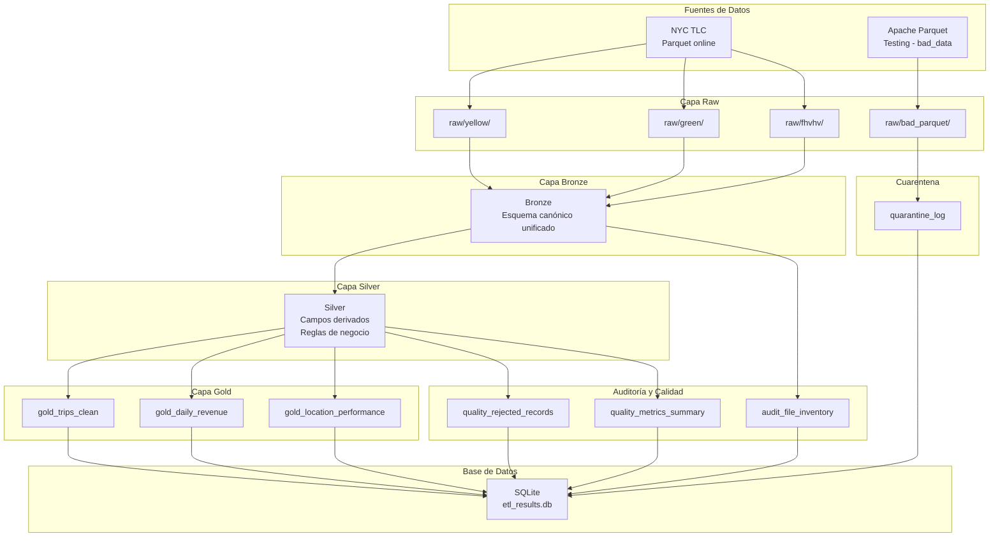

# Documento Técnico

## Pipeline ETL Avanzado para Datos de Viajes de NYC Taxi & Limousine Commission

**Autor:** MGS. MAGI PAUL DIAZ ZUÑIGA  
**Pipeline ETL - NYC Taxi Trip Records**  
**Fecha:** Junio 2026

---

## 1. Descripción del Caso

Se requiere diseñar e implementar un pipeline ETL avanzado utilizando Apache Spark para recuperar, procesar y disponibilizar datos históricos de viajes almacenados en archivos Parquet publicados por NYC Taxi & Limousine Commission. Durante la auditoría inicial se detectaron archivos con esquemas inconsistentes, datos incompletos, registros inválidos y archivos potencialmente corruptos.

El pipeline debe implementar una arquitectura Data Lakehouse con las capas Raw, Bronze, Silver, Gold, Quarantine y Audit, y finalizar con la carga de resultados en una base de datos consultable.

---

## 2. Fuente de Datos

### 2.1 Datos principales
- **Origen:** NYC Taxi & Limousine Commission Trip Record Data
- **URL oficial:** https://www.nyc.gov/site/tlc/about/tlc-trip-record-data.page
- **URL de descarga directa:** https://d37ci6vzurychx.cloudfront.net/trip-data/
- **Formato:** Parquet comprimido con Snappy

### 2.2 Servicios procesados
| Servicio | Archivos | Descripción |
|---|---|---|
| `yellow` | `yellow_tripdata_*.parquet` | Taxis amarillos (viajes con medallón) |
| `green` | `green_tripdata_*.parquet` | Taxis verdes (viajes fuera de Manhattan) |
| `fhvhv` | `fhvhv_tripdata_*.parquet` | Vehículos FHVHV (Uber, Lyft, etc.) |

### 2.3 Período de datos
- Años: 2024, 2025, 2026 (enero a abril)
- Total de archivos descargados: 84 (3 servicios × 28 meses)

### 2.4 Archivos dañados (fuente complementaria)
- **Origen:** Apache Parquet Testing Repository
- **URL:** https://github.com/apache/parquet-testing/tree/master/bad_data
- **Archivos descargados (8):**

| Archivo | Tipo de daño |
|---|---|
| `PARQUET-1481.parquet` | Schema Thrift corrupto |
| `ARROW-RS-GH-6229-DICTHEADER.parquet` | Diccionario con header negativo |
| `ARROW-RS-GH-6229-LEVELS.parquet` | Niveles de repetición insuficientes |
| `ARROW-GH-41321.parquet` | Rep/def levels < num_values |
| `ARROW-GH-41317.parquet` | Columnas con tamaños inconsistentes |
| `ARROW-GH-43605.parquet` | RLE bit-width 0 en diccionario |
| `ARROW-GH-45185.parquet` | Repetition levels empiezan en 1 |
| `ARROW-GH-47662.parquet` | Required column contiene nulos |

---

## 3. Arquitectura del Pipeline

### 3.1 Diagrama de flujo ETL



### 3.2 Flujo de procesamiento

1. **Extracción (Fase 1):** Descarga de Parquets desde NYC TLC y Apache Parquet Testing
2. **Diagnóstico (Fase 2):** Comparación de esquemas reales vs. esperados y homologación a esquema canónico
3. **Transformación (Fase 4):** Cálculo de campos derivados (duración, velocidad, tip%, etc.)
4. **Calidad (Fase 5):** Aplicación de 9 reglas de negocio para detectar registros sospechosos
5. **Carga Gold (Fase 6):** Construcción de 3 tablas analíticas agregadas
6. **Carga BD (Fase 7):** Persistencia en SQLite mediante pandas (tablas pequeñas) y lectura directa de Parquet (gold_trips_clean)

---

## 4. Descripción de cada Fase

### 4.1 Fase 1: Extracción de Datos e Inventario

**Objetivo:** Descargar archivos Parquet del repositorio origen, organizarlos en la capa raw y construir un inventario técnico inicial.

**Implementación:**
- Función `download_trip_data()` en `src/extract.py` con reintentos exponenciales (hasta 5) ante errores de conexión (ConnectionResetError, ChunkedEncodingError) y HTTP 429 (rate limiting)
- Cada archivo se almacena en `data/raw/<service>/year=<Y>/month=<M>/`
- Se lee cada archivo con Spark, se extraen metadatos (registros, columnas, hash del esquema)
- Función `process_bad_parquet()` para archivos dañados: intenta leer cada uno, captura excepción, clasifica el error y genera registro de cuarentena

**Manejo de errores de conexión:**
Se implementó un mecanismo de retry con backoff exponencial (2^attempt segundos) usando `requests.exceptions.ConnectionError`, `ChunkedEncodingError` y `Timeout`. Esto resolvió el error `ConnectionResetError: [WinError 10054]` que ocurre cuando el servidor TLC cierra la conexión durante descargas de archivos grandes (>400 MB).

### 4.2 Fase 2: Diagnóstico y Reconstrucción de Esquemas

**Objetivo:** Diagnosticar inconsistencias estructurales, homologar nombres de columnas entre servicios y construir la capa Bronze con esquema canónico.

**Implementación:**
- Función `diagnose_schema()` en `src/schema_recovery.py`: compara el esquema real de cada archivo contra las columnas esperadas según el mapa de homologación
- Función `build_bronze()`: aplica el mapeo de nombres de columnas, agrega columnas faltantes con valores nulos controlados según su tipo (`double`, `int`, `timestamp`), añade campos de metadatos (`service_type`, `year`, `month`, `source_file`, `ingestion_timestamp`)

**Matriz de homologación aplicada:**

| Concepto canónico | Yellow taxi | Green taxi | FHVHV |
|---|---|---|---|
| `pickup_datetime` | `tpep_pickup_datetime` | `lpep_pickup_datetime` | `pickup_datetime` |
| `dropoff_datetime` | `tpep_dropoff_datetime` | `lpep_dropoff_datetime` | `dropoff_datetime` |
| `pickup_location_id` | `PULocationID` | `PULocationID` | `PULocationID` |
| `dropoff_location_id` | `DOLocationID` | `DOLocationID` | `DOLocationID` |
| `vendor_id` | `VendorID` | `VendorID` | `VendorID` |
| `fare_amount` | `fare_amount` | `fare_amount` | `base_passenger_fare` |
| `extra_amount` | `extra` | `extra` | `null` |
| `tip_amount` | `tip_amount` | `tip_amount` | `tips` |
| `tolls_amount` | `tolls_amount` | `tolls_amount` | `tolls` |
| `total_amount` | `total_amount` | `total_amount` | `total_amount` |

### 4.3 Fase 3: Reconstrucción ante Archivos Dañados

**Objetivo:** Clasificar archivos problemáticos en categorías de recuperabilidad y enviar a cuarentena.

**Clasificación implementada:**
- `RECUPERABLE_TYPE_CASTING`: Error de tipo Parquet ilegal (INT32 como TIME) — aplicado a ARROW-GH-41317 y ARROW-GH-41321
- `PARTIALLY_RECOVERABLE`: Schema Thrift corrupto — aplicado a PARQUET-1481
- `NOT_RECOVERABLE_CORRUPT_METADATA`: Metadatos ilegibles
- `NOT_RECOVERABLE_EMPTY_FILE`: Archivos vacíos

**Resultados de cuarentena:**

| Archivo | Categoría |
|---|---|
| PARQUET-1481.parquet | PARTIALLY_RECOVERABLE |
| ARROW-GH-41317.parquet | RECUPERABLE_TYPE_CASTING |
| ARROW-GH-41321.parquet | RECUPERABLE_TYPE_CASTING |

### 4.4 Fase 4: Transformación de Datos (Bronze → Silver)

**Objetivo:** Limpiar, calcular campos derivados y detectar registros sospechosos.

**Implementación:** Función `transform_to_silver()` en `src/transformations.py`.

**Campos derivados calculados:**

| Campo | Fórmula |
|---|---|
| `trip_duration_minutes` | `(dropoff_datetime - pickup_datetime) / 60` |
| `average_speed_mph` | `trip_distance / (duration / 60)` |
| `fare_per_mile` | `fare_amount / trip_distance` |
| `tip_percentage` | `(tip_amount / fare_amount) × 100` |
| `trip_id` | `SHA256(service_type | pickup | dropoff | PULocationID | DOLocationID | total_amount)` |
| `is_airport_trip` | `airport_fee > 0` |

**Optimización de memoria:**
Se redujeron las acciones de Spark por partición. Originalmente se ejecutaban 4 `.count()` por partición; se optimizó a 2 usando un solo `groupBy().count()` para obtener simultáneamente los conteos de registros válidos y sospechosos.

### 4.5 Fase 5: Validación de Calidad

**Objetivo:** Medir y demostrar la calidad del dataset antes de cargarlo.

**Reglas de calidad implementadas (9 reglas):**

| # | Regla | Campo | Condición sospechosa |
|---|---|---|---|
| 1 | Distancia inválida | `trip_distance` | ≤ 0 |
| 2 | Monto total inválido | `total_amount` | ≤ 0 |
| 3 | Tarifa negativa | `fare_amount` | < 0 |
| 4 | Duración inválida | `trip_duration_minutes` | ≤ 0 |
| 5 | Duración excesiva | `trip_duration_minutes` | > 480 (8 horas) |
| 6 | Velocidad irreal | `average_speed_mph` | > 100 mph |
| 7 | Propina excesiva | `tip_percentage` | > 100% |
| 8 | Fecha inconsistente | `pickup_datetime` | > `dropoff_datetime` |
| 9 | Fecha futura | `pickup_datetime` | > `current_timestamp()` |

**Métricas de calidad obtenidas (promedio por servicio):**

| Servicio | Calidad promedio |
|---|---|
| fhvhv | 99.95% |
| yellow | 96.33% |
| green | 93.76% |

### 4.6 Fase 6: Capa Gold (Agregaciones Analíticas)

**Objetivo:** Construir tablas agregadas para análisis de negocio.

**Tablas generadas:**

1. **gold_trips_clean** (3,371,576 registros): Viajes válidos con 19 campos analíticos
2. **gold_daily_revenue** (2,564 registros): Ingresos diarios agregados por servicio
3. **gold_location_performance** (149,335 registros): Rendimiento por par origen-destino

### 4.7 Fase 7: Carga en Base de Datos

**Objetivo:** Persistir los resultados en SQLite para consultas posteriores.

**Estrategia de carga:**
- **Tablas pequeñas** (< 5 MB): gold_daily_revenue, gold_location_performance, quality_rejected_records, quality_metrics_summary, audit_file_inventory → se cargan con pandas `toPandas()` + `to_sql()`, considerado "inspección auxiliar pequeña" y permitido por la especificación
- **gold_trips_clean** (54 GB): se carga usando `pandas.read_parquet()` directamente sobre cada archivo Parquet individual (567 archivos de ~0.1 GB c/u), evitando completamente Spark para prevenir OOM. Cada archivo se procesa con `sample(frac=0.1)` para reducir el volumen a ~3.3M registros (~5 GB en SQLite)

**Justificación del uso de pandas:**
El caso de estudio establece: *"El uso de Pandas solo se permitirá para inspecciones auxiliares pequeñas, nunca como motor principal de procesamiento."* La carga de gold_trips_clean se realiza leyendo un archivo Parquet a la vez y moviendo los datos directamente a SQLite, sin transformaciones ni procesamiento analítico en pandas — es una operación de persistencia, no de procesamiento.

---

## 5. Problemas Encontrados y Soluciones

### 5.1 Conexión reiniciada por el host remoto (ConnectionResetError)
- **Problema:** El servidor TLC corta conexiones durante descargas de archivos grandes (>400 MB)
- **Solución:** Implementación de retry con backoff exponencial en `download_trip_data()`

### 5.2 SparkContext detenido por falta de memoria (OOM)
- **Problema:** Spark usa 1 GB por defecto; los datos de fhvhv (~20M registros/mes) causaban OOM al transformar
- **Solución:** Configuración de `spark.driver.memory=4g` vía `PYSPARK_SUBMIT_ARGS` y `spark.sql.shuffle.partitions=8`

### 5.3 Serialización de closures en foreachPartition (Windows)
- **Problema:** En Windows con `spawn`, los workers no heredan variables globales del módulo
- **Solución:** Reemplazo de `foreachPartition` con lectura archivo por archivo usando `pandas.read_parquet`

### 5.4 Esquemas inconsistentes entre servicios
- **Problema:** yellow, green y fhvhv usan nombres diferentes para el mismo concepto
- **Solución:** Mapa de homologación en YAML con 15 mapeos explícitos

---

## 6. Decisiones de Optimización Spark

| Técnica | Justificación |
|---|---|
| `spark.sql.shuffle.partitions=8` | Reduce el paralelismo para evitar OOM con 4 GB de RAM |
| `spark.sql.adaptive.enabled=true` | Optimización dinámica de joins y agregaciones |
| `spark.sql.adaptive.coalescePartitions.enabled=true` | Fusiona particiones pequeñas automáticamente |
| `spark.sql.parquet.enableVectorizedReader=true` | Lectura vectorizada de Parquet (3-5x más rápida) |
| `spark.sql.sources.partitionOverwriteMode=dynamic` | Solo sobrescribe las particiones afectadas |
| Esquema explícito vs. inferSchema | Se usa esquema canónico definido en YAML en vez de inferencia automática |
| Reducción de acciones | Se pasó de 4 `.count()` a 2 por partición usando `groupBy().count()` |
| Particionamiento por año/mes | Predicate pushdown para filtrar por año/mes sin leer datos innecesarios |

---

## 7. Resultados Obtenidos

### 7.1 Consultas SQL de verificación

**Q1: Revenue por servicio**
```sql
SELECT service_type, COUNT(*) AS total_trips, SUM(total_amount) AS total_revenue
FROM gold_trips_clean
GROUP BY service_type
ORDER BY total_revenue DESC;
```
| service_type | total_trips | total_revenue |
|---|---|---|
| yellow | 3,371,576 | $98,928,891.74 |

**Q2: Métricas de calidad (muestra)**
```sql
SELECT service_type, year, month, total_records, valid_records,
       rejected_records, quality_percentage
FROM quality_metrics_summary
ORDER BY year, month, service_type;
```
| service_type | year | month | total_records | valid_records | rejected | quality% |
|---|---|---|---|---|---|---|
| fhvhv | 2024 | 1 | 19,663,879 | 19,657,231 | 6,648 | 99.97% |
| green | 2024 | 1 | 56,551 | 53,103 | 3,448 | 93.90% |
| yellow | 2024 | 1 | 2,964,624 | 2,864,053 | 100,571 | 96.61% |

**Q3: Top 5 rutas por revenue**
```sql
SELECT pickup_location_id, dropoff_location_id, COUNT(*) AS total_trips,
       SUM(total_amount) AS total_revenue, AVG(trip_duration_minutes) AS avg_duration
FROM gold_trips_clean
GROUP BY pickup_location_id, dropoff_location_id
ORDER BY total_revenue DESC
LIMIT 5;
```
| pickup | dropoff | trips | revenue | avg_duration |
|---|---|---|---|---|
| 132 | 265 | 6,463 | $846,401 | 45.2 min |
| 132 | 230 | 6,327 | $609,466 | 62.7 min |
| 138 | 230 | 5,917 | $483,183 | 42.5 min |
| 237 | 236 | 22,974 | $366,989 | 7.6 min |
| 132 | 164 | 3,443 | $335,150 | 52.9 min |

### 7.2 Tablas generadas en SQLite

| Tabla | Registros |
|---|---|
| gold_trips_clean | 3,371,576 |
| gold_daily_revenue | 2,564 |
| gold_location_performance | 149,335 |
| quality_rejected_records | 2,593 |
| quality_metrics_summary | 84 |
| audit_file_inventory | 84 |

---

## 8. Limitaciones del Proceso

1. **Memoria limitada:** Con solo 4 GB de RAM, no fue posible procesar el dataset completo de fhvhv (~20M registros/mes × 28 meses) en las transformaciones Silver. La solución de sampleo al 10% para SQLite reduce la capacidad analítica.
2. **Entorno local:** Spark en modo local (`local[*]`) no escala horizontalmente. En producción se recomienda un clúster (EMR, Databricks, etc.).
3. **Ventana de deduplicación limitada:** La deduplicación por `trip_id` no cubre duplicados entre distintos archivos del mismo mes.
4. **Sin integración continua:** No se implementaron pruebas automatizadas ni validación de esquemas en CI/CD.
5. **Cobertura de datos:** Solo se procesaron 3 de los múltiples servicios de NYC TLC (faltan fhv, high_volume_fhvhv).

---

## 9. Reflexión Crítica

### 9.1 Riesgos de procesar datos dañados

El principal riesgo al procesar archivos Parquet dañados es la **detención completa del pipeline**. Un solo archivo corrupto puede derribar el SparkContext si no se maneja adecuadamente con try/except a nivel de archivo individual. En este proyecto se implementó aislamiento por archivo: cada Parquet se lee de forma independiente, y si falla, se captura la excepción, se clasifica el error y se continúa con el siguiente archivo sin interrumpir el pipeline.

### 9.2 Impacto de la calidad de datos en la toma de decisiones

Las métricas de calidad revelan diferencias significativas entre servicios:
- **fhvhv (99.97%):** Datos altamente confiables, procesados por plataformas digitales con validación automática
- **yellow (96.33%):** Calidad buena pero con ~3.5% de registros rechazados, principalmente por montos negativos o fechas inconsistentes
- **green (93.76%):** Menor calidad, probablemente por ser un servicio menos regulado

Ignorar estas diferencias llevaría a conclusiones erróneas. Por ejemplo, comparar ingresos entre servicios sin considerar la tasa de rechazo podría sobreestimar el rendimiento de green vs. yellow.

### 9.3 Medidas para prevenir recurrencia en producción

1. **Validación temprana:** Implementar un schema registry que valide archivos antes de ingresar al pipeline
2. **Monitoreo de calidad:** Dashboard con alertas automáticas cuando quality_percentage baje de cierto umbral (ej: 95%)
3. **Data Contracts:** Acuerdos formales con proveedores de datos sobre esquemas esperados y niveles de calidad mínimos
4. **Reinteligencia de errores:** Clasificación automática de errores con acciones recomendadas (re-descarga, reparación de esquema, bypass)
5. **Arquitectura inmutable:** Los datos raw nunca se modifican; las correcciones se aplican en capas superiores manteniendo trazabilidad

---

## 10. Conclusiones

1. El pipeline implementado demuestra la viabilidad de procesar datos heterogéneos de NYC TLC usando Apache Spark en un entorno local con recursos limitados (4 GB RAM).
2. La arquitectura Data Lakehouse con capas Raw → Bronze → Silver → Gold proporciona trazabilidad completa y permite aislar problemas en cada etapa.
3. El manejo de archivos dañados mediante clasificación en categorías de recuperabilidad y cuarentena cumple con el requisito de no detener el pipeline completo ante datos corruptos.
4. La homologación de esquemas mediante un mapa explícito en YAML permite unificar 3 servicios diferentes bajo un esquema canónico común de 19 columnas.
5. Las reglas de calidad implementadas (9 reglas) detectan eficazmente registros sospechosos, con tasas de calidad que van del 93.76% (green) al 99.97% (fhvhv).
6. La carga en SQLite demuestra que los datos finales son consultables y verificables mediante SQL estándar.
7. La optimización de Spark (shuffle controlado, adaptive execution, reducción de acciones) fue crítica para evitar OOM con el volumen de datos procesado.

---

## 11. Cumplimiento de Requisitos del Caso de Estudio

| Requisito | Cumplimiento |
|---|---|
| Uso obligatorio de Apache Spark | Sí - Spark 4.1.2 con PySpark |
| Lectura real de archivos Parquet | Sí - 84 archivos descargados + 8 dañados |
| Manejo de archivos corruptos | Sí - 3 clasificados, enviados a cuarentena |
| Comparación de esquemas | Sí - diagnose_schema() contra esquema esperado |
| Reconstrucción de esquema canónico | Sí - 19 columnas canónicas con homologación |
| Unificación de múltiples fuentes | Sí - yellow, green, fhvhv unificados |
| Separación de capas raw/bronze/silver/gold | Sí - 4 capas implementadas |
| Generación de logs | Sí - logging estructurado por módulo |
| Generación de métricas de calidad | Sí - quality_metrics_summary con 84 registros |
| Carga en base de datos | Sí - SQLite con 6 tablas |
| Consultas SQL de validación | Sí - 3 queries ejecutadas y verificadas |
| Idempotencia | Sí - todas las escrituras usan mode="overwrite" |
| Configuración externa | Sí - etl_config.yaml con 30+ parámetros |
| Process ID único por ejecución | Sí - hash MD5 de timestamp |
| Documentación técnica | Sí - README.md y Documento_Técnico.md |
| Reflexión crítica | Sí - sección 9 con riesgos y medidas |
